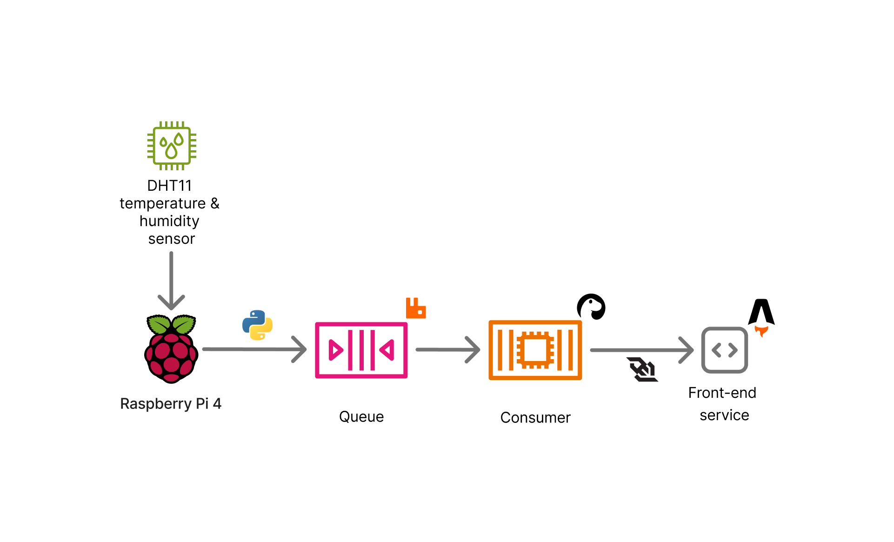

# DHT11, Python, RabbitMQ and Deno Example

This project demonstrates a simple system for publishing and consuming sensor data (simulated temperature and humidity) using RabbitMQ as a message broker.

It consists of two main components:

1.  **Python Publisher (`src/app.py`):**
    *   Simulates reading data from a sensor (e.g., a DHT11).
    *   Publishes these readings as JSON messages to a RabbitMQ queue named `sensor_data`.
    *   Configured to connect to a RabbitMQ instance, potentially running locally via Docker (`compose.yaml`) or a remote instance.

2.  **Deno Consumer (`consumer/main.ts`):**
    *   Connects to the same RabbitMQ instance.
    *   Subscribes to the `sensor_data` queue.
    *   Receives and processes the JSON messages published by the Python application. This can be extended for various purposes like logging, alerting, or data analysis.

## Technology Stack

*   **Python:** For the data publishing application.
    *   `pika`: RabbitMQ client library.
*   **Deno:** For the data consuming application.
    *   `amqplib`: RabbitMQ client library.
    *   `dotenv`: For managing environment variables.
*   **RabbitMQ:** Message broker for decoupling the publisher and consumer.
    *   Can be run locally using the provided `compose.yaml` or connected to a remote instance.
*   **Docker:** Used for containerizing RabbitMQ and potentially for deploying the consumer application.

